# 🚀 MediBridge

> A modern, production-grade healthcare consultation and doctor appointment scheduling ecosystem connecting patients, medical practitioners, and platform administrators.

[](https://nodejs.org/)
[](https://expressjs.com/)
[](https://react.dev/)
[](https://tailwindcss.com/)
[](https://www.mongodb.com/)
[](https://vitejs.dev/)
[](https://cloudinary.com/)

---

## 📋 Table of Contents

- [📖 Overview](#-overview)
- [✨ Features](#-features)
  - [Patient Experience (Frontend)](#-patient-experience-frontend)
  - [Doctor Practitioner Experience (Admin Portal)](#-doctor-practitioner-experience-admin-portal)
  - [Platform Administration (Admin Portal)](#-platform-administration-admin-portal)
  - [Booking Engine & Concurrency Control](#-booking-engine--concurrency-control)
  - [Payment & Refund Lifecycle](#-payment--refund-lifecycle)
- [📸 Screenshots](#-screenshots)
  - [1. Patient Experience](#1-patient-experience)
  - [2. Doctor Practitioner Experience](#2-doctor-practitioner-experience)
  - [3. Administrator Experience](#3-administrator-experience)
- [👥 User Roles & Permissions](#-user-roles--permissions)
- [🏗️ System Architecture](#️-system-architecture)
  - [High-Level Architecture](#high-level-architecture)
  - [Appointment & Slot Lifecycle](#appointment--slot-lifecycle)
  - [Payment & Refund State Machine](#payment--refund-state-machine)
- [🗄️ Database Models](#️-database-models)
- [🧰 Tech Stack](#-tech-stack)
- [🔌 API Reference](#-api-reference)
  - [User & Patient Endpoints (`/api/v1/user`)](#user--patient-endpoints-apiv1user)
  - [Doctor Practitioner Endpoints (`/api/v1/doctor`)](#doctor-practitioner-endpoints-apiv1doctor)
  - [Administrator Endpoints (`/api/v1/admin`)](#administrator-endpoints-apiv1admin)
  - [Payment Gateway Endpoints (`/api/v1/payment`)](#payment-gateway-endpoints-apiv1payment)
- [⚙️ Environment Variables](#️-environment-variables)
- [🚀 Getting Started](#-getting-started)
  - [Prerequisites](#prerequisites)
  - [Installation & Local Setup](#installation--local-setup)
  - [Running the Application](#running-the-application)
- [📂 Project Structure](#-project-structure)
- [🔒 Security & Authentication](#-security--authentication)
- [📄 License](#-license)

---

## 📖 Overview

**MediBridge** is an enterprise-ready healthcare platform engineered to streamline the entire medical appointment lifecycle. It bridges the gap between patients looking for specialized medical care, doctors managing their clinical appointments and practice revenue, and healthcare administrators overseeing platform operations.

### Problems Solved:
- **Scheduling Conflicts & Double-Booking**: Employs normalized slot mapping with real-time slot locking to eliminate double-booking across timezones and concurrent user sessions.
- **Fragmented Healthcare Management**: Unifies patient booking, doctor consultation workflows, earnings tracking, and administrative governance into a single modular architecture.
- **Payment & Refund Overhead**: Features an integrated payment state machine supporting instant online simulation, pay-at-clinic workflows, and automated slot release with refund processing upon cancellation.
- **Practitioner Discovery**: Enables patients to browse certified doctors across medical specialities, inspect credentials, experience, and consultation fees, and book guaranteed 30-minute consultation windows.

---

## ✨ Features

### 🧑‍⚕️ Patient Experience (Frontend)
- **Interactive Landing Hub**: Hero showcase with speciality badges, featured doctors, and promotional banners.
- **Speciality Exploration**: Filter practitioners across 7 core specialities:
  - *General physician*, *Cardiologist*, *Gynecologist*, *Dermatologist*, *Pediatricians*, *Neurologist*, *Gastroenterologist*.
- **Comprehensive Doctor Profiles**: View verified practitioner credentials, medical degree, clinical experience, clinic address, and consultation fees.
- **Dynamic 7-Day Slot Picker**: Select from automatically generated 30-minute consultation slots (10:00 AM – 09:00 PM) filtered against existing practitioner bookings.
- **Patient Authentication & Profile Management**:
  - Secure registration and login with input validation (`validator.js`).
  - Personal profile editor with Cloudinary avatar upload, address fields, date of birth, and gender selection.
  - Automatic deletion of outdated Cloudinary profile images upon replacement.
- **Appointment Schedule & Status Tracker**:
  - Live tracking of all patient appointments categorized by status: `Pending`, `Paid`, `Pay in Clinic` (`cash`), `Refunded`, `Cancelled`, and `Completed`.
  - In-app cancellation with automatic slot release and refund processing for prepaid visits.
- **Simulated Payment Gateway**:
  - Interactive checkout modal with itemized fee summary.
  - Simulation of successful payment transactions and failure states.

### 🩺 Doctor Practitioner Experience (Admin Portal)
- **Clinical Practice Dashboard**:
  - Live revenue analytics: Aggregated practice earnings from both online paid appointments and completed clinic visits.
  - Key practice metrics: Total patient visits and unique patient base count.
  - Real-time stream of latest consultation bookings.
- **Patient Consultations Management**:
  - Comprehensive consultation ledger displaying patient demographic info, computed age, scheduled time slot, and consultation fee.
  - One-click **Accept** action (confirming the appointment and switching pending payments to clinic cash mode).
  - One-click **Reject / Cancel** action (cancelling appointment, triggering refund if paid, and freeing the slot).
  - Consultation completion tracking.
- **Practitioner Profile Customization**:
  - Update biography (`about`), consultation fee (`fees`), and clinic address lines.
  - Real-time availability toggle (`available`) allowing doctors to pause or resume accepting new bookings.

### 🛡️ Platform Administration (Admin Portal)
- **Administrative Overview**:
  - Platform-wide telemetry: Registered Verified Doctors, Total Appointments Booked, and Active Unique Patients.
  - Master activity feed of recent consultation requests across all practitioners.
- **Doctor Onboarding & Verification**:
  - Comprehensive onboarding pipeline to register certified medical practitioners.
  - Multi-part form supporting profile image upload to Cloudinary, medical degrees, primary speciality, experience level, consultation fees, clinic address, and account credentials.
- **Doctor Directory Management**:
  - Global catalog of all registered practitioners with live search and metadata cards.
  - Instant booking availability switches enabling administrators to toggle practitioner visibility platform-wide.
- **Master Booking Schedule**:
  - Complete schedule of all system-wide patient bookings.
  - Detailed inspection of patient demographics (name, age, gender, contact number, email, address) and assigned doctor information.
  - Universal administrative override to cancel bookings with automated payment refund and slot release.

### ⚡ Booking Engine & Concurrency Control
- **Dynamic Date & Time Slot Matrix**: Calculates rolling 7-day windows starting from current system time.
- **Unicode-Normalized Slot Validation**: Normalizes string representations across browsers to prevent slot key mismatch.
- **Atomic Map Updates**: Stores booked slots directly inside the Doctor schema using a Mongoose Map keyed by date string (`D_M_YYYY`).

### 💳 Payment & Refund Lifecycle
- **Five-State Payment Engine**:
  - `pending`: Initial state upon booking with payment required.
  - `paid`: Transitioned after successful gateway transaction.
  - `failed`: Transitioned if payment gateway rejects transaction.
  - `cash`: Transitioned when doctor accepts a pending booking for in-clinic payment.
  - `refunded`: Automatically applied when a `paid` booking is cancelled by patient, doctor, or admin.
- **Automated Slot Freeing**: Releasing a cancelled or refunded booking instantly returns the 30-minute slot back to the doctor's available pool.

---

## 📸 Screenshots

### 1. Patient Experience

| Landing & Speciality Discovery | Patient Authentication |
| :---: | :---: |
|  | 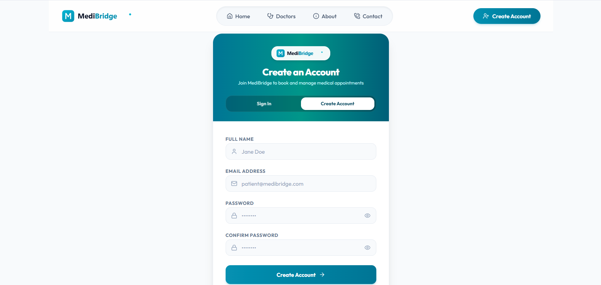 |
| *Hero discovery hub with instant speciality navigation* | *Patient login and secure onboarding interface* |

| Doctor Directory & Filtering | Doctor Profile & Slot Selection |
| :---: | :---: |
| 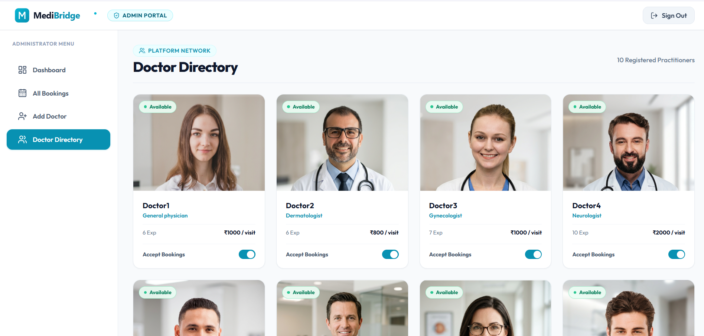 | 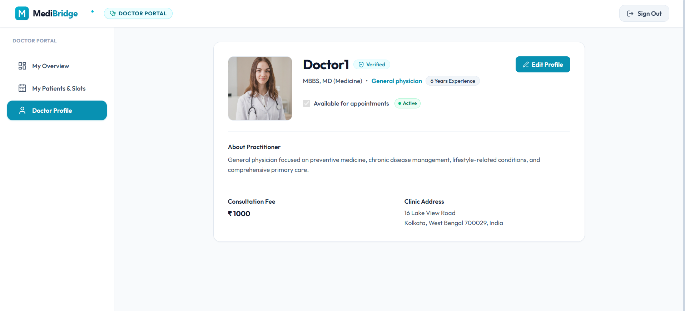 |
| *Directory catalog with speciality filtering and availability badges* | *Doctor profile with verified credentials and 7-day slot selector* |

| Patient Appointments Management | Simulated Payment Gateway |
| :---: | :---: |
| 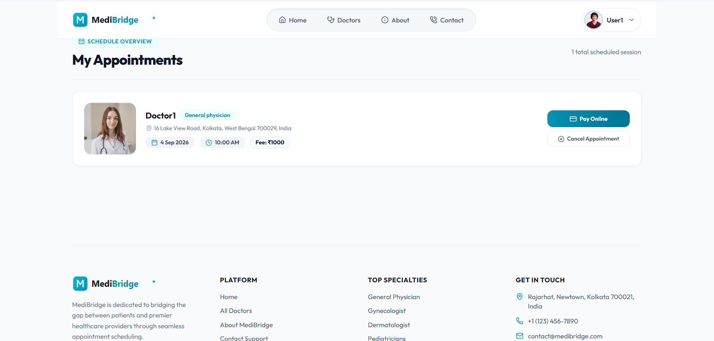 |  |
| *Live appointment tracker with payment status badges and refund actions* | *Simulated checkout gateway supporting test payments and failure paths* |

---

### 2. Doctor Practitioner Experience

| Clinical Dashboard & Practice Earnings | Patient Consultations & Slot Actions |
| :---: | :---: |
| 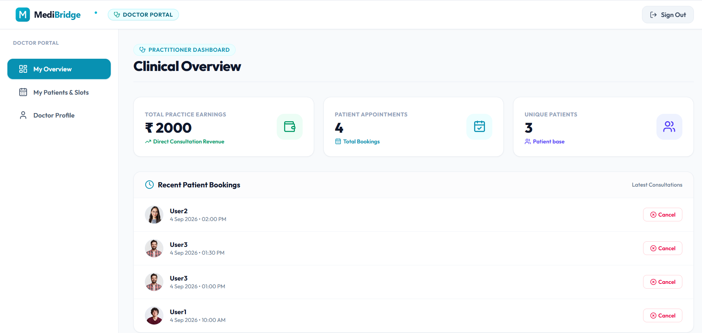 | 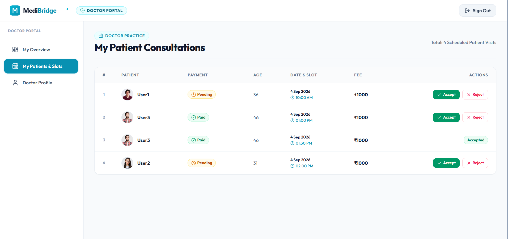 |
| *Practitioner dashboard displaying total earnings, patient count, and revenue* | *Consultation ledger with patient demographics, payment badges, and Accept/Reject controls* |

---

### 3. Administrator Experience

| Administrative Overview & Platform Analytics | Master Schedule of All Bookings |
| :---: | :---: |
| 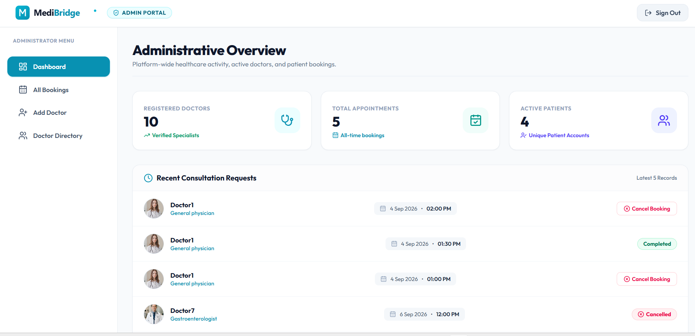 | 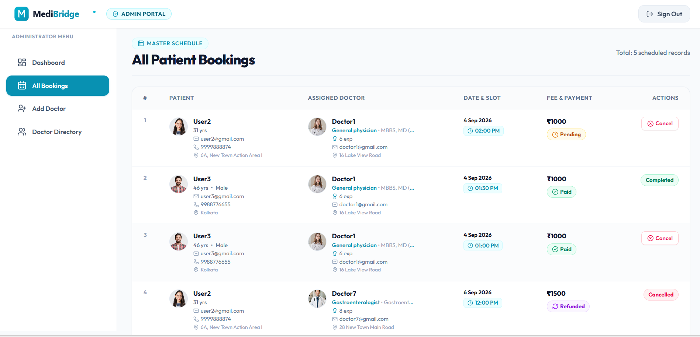 |
| *Administrative overview monitoring registered doctors, active patients, and booking metrics* | *Master schedule ledger displaying all platform bookings and demographic details* |

| Practitioner Onboarding |
| :---: |
| 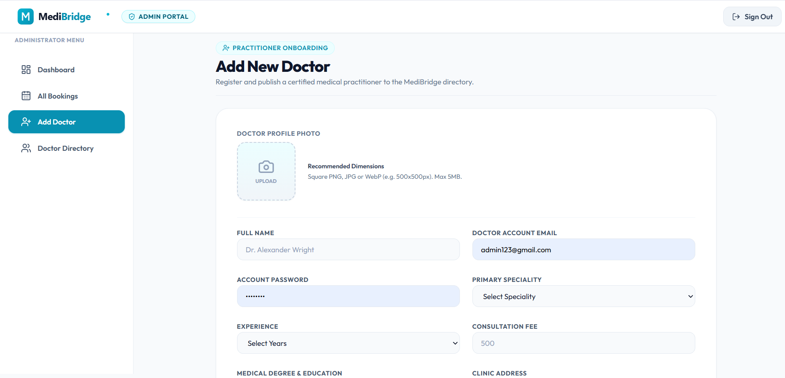 |
| *Doctor registration form with Cloudinary image upload, credentials, degrees, and clinic address* |

---

## 👥 User Roles & Permissions

| Role | Access Scope | Key Capabilities & Responsibilities |
| :--- | :--- | :--- |
| **Patient / User** | Frontend App (`/`) | • Register and maintain patient profile with Cloudinary avatar<br>• Browse doctors, filter by medical speciality, and view practitioner profiles<br>• Book 30-minute consultation slots across a rolling 7-day window<br>• Execute demo payments or choose pay-in-clinic options<br>• Track appointment history and initiate cancellation with automated refunds |
| **Doctor / Practitioner** | Admin Portal (`/`) | • Authenticate via dedicated doctor credentials<br>• Access clinical practice overview with total direct consultation earnings<br>• Review assigned patient appointments with computed age and demographics<br>• Accept consultations (converting payment to in-clinic cash mode) or reject appointments<br>• Mark appointments as completed<br>• Manage personal biography, consultation fee, clinic address, and availability switch |
| **Administrator** | Admin Portal (`/`) | • Authenticate using secure environment-level administrative credentials<br>• Monitor platform-wide metrics (total doctors, appointments, registered patients)<br>• Onboard new medical practitioners with image assets, degrees, and clinic addresses<br>• Manage platform doctor directory and toggle practitioner booking availability<br>• Oversee master schedule and cancel bookings with automated payment refund |

---

## 🏗️ System Architecture

### High-Level Architecture

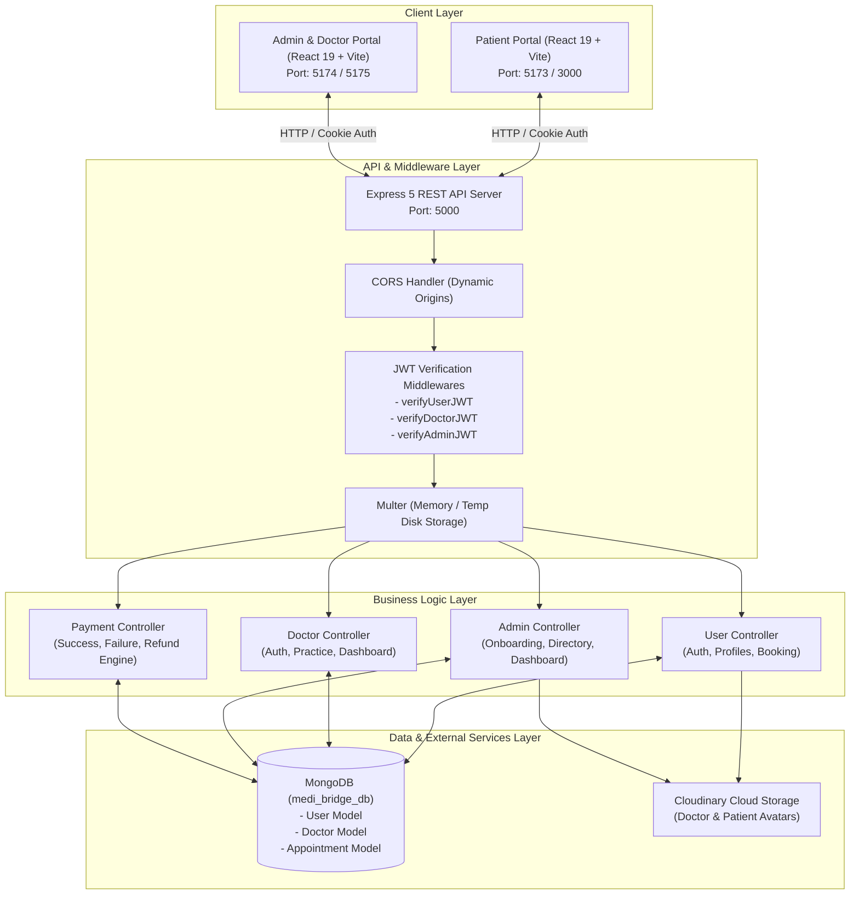

---

### Appointment & Slot Lifecycle

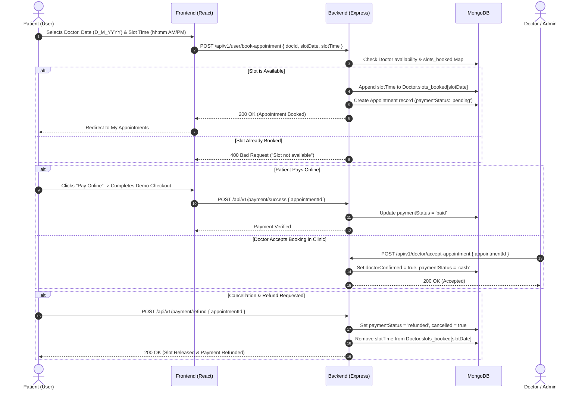

---

### Payment & Refund State Machine

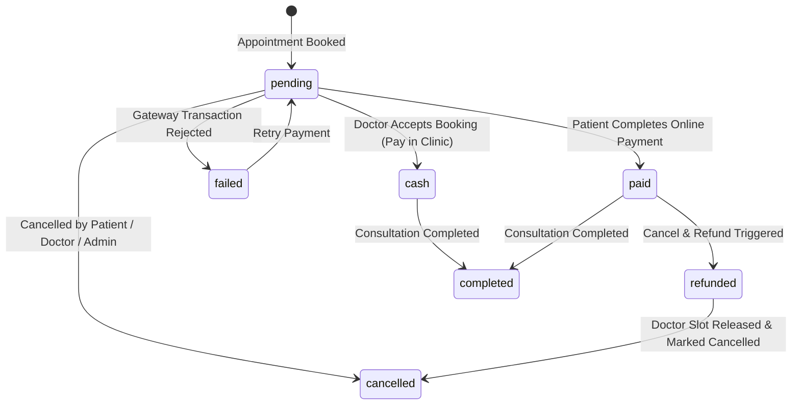

---

## 🗄️ Database Models

### 1. `User` Model (`users` collection)
Stores patient profile information, credentials, and authentication state.

```javascript
{
  name: { type: String, required: true, trim: true, minlength: 2, maxlength: 50 },
  email: { type: String, required: true, unique: true, lowercase: true, index: true },
  password: { type: String, required: true, minlength: 8, select: false },
  refreshToken: { type: String, select: false },
  image: { type: String, default: "<base64_default_avatar>" },
  address: {
    line1: { type: String, default: "" },
    line2: { type: String, default: "" },
    city: { type: String, default: "" },
    state: { type: String, default: "" },
    pincode: { type: String, default: "" }
  },
  gender: { type: String, enum: ["Male", "Female", "Other", "Not Selected"], default: "Not Selected" },
  dob: { type: Date, default: null },
  phone: { type: String, match: [/^[0-9]{10}$/, "Please enter a valid phone number"] },
  createdAt: Date,
  updatedAt: Date
}
```

### 2. `Doctor` Model (`doctors` collection)
Stores verified medical practitioners, credentials, specialities, consultation fees, and real-time booked slots.

```javascript
{
  name: { type: String, required: true, trim: true },
  email: { type: String, required: true, unique: true, lowercase: true, trim: true },
  password: { type: String, required: true, select: false },
  image: { type: String, required: true },
  speciality: { type: String, required: true },
  degree: { type: String, required: true },
  experience: { type: String, required: true },
  about: { type: String, required: true },
  available: { type: Boolean, default: true },
  fees: { type: Number, required: true },
  address: {
    line1: { type: String, required: true },
    line2: { type: String, default: "" }
  },
  slots_booked: {
    type: Map,
    of: [String],
    default: {} // Key: "D_M_YYYY", Value: ["10:00 AM", "01:30 PM"]
  },
  doctorConfirmed: { type: Boolean, default: false },
  createdAt: Date,
  updatedAt: Date
}
```

### 3. `Appointment` Model (`appointments` collection)
Captures consultation contracts between patients and doctors with transactional state.

```javascript
{
  userId: { type: mongoose.Schema.Types.ObjectId, ref: "User", required: true },
  userData: { type: Object, required: true },
  docId: { type: mongoose.Schema.Types.ObjectId, ref: "Doctor", required: true },
  docData: { type: Object, required: true },
  amount: { type: Number, required: true },
  confirmed: { type: Boolean, default: false },
  doctorConfirmed: { type: Boolean, default: false },
  slotDate: { type: String, required: true }, // Format: "D_M_YYYY"
  slotTime: { type: String, required: true }, // Format: "hh:mm AM/PM"
  date: { type: Number, required: true },     // Timestamp
  cancelled: { type: Boolean, default: false },
  paymentStatus: {
    type: String,
    default: "pending",
    enum: ["pending", "paid", "failed", "refunded", "cash"]
  },
  createdAt: Date,
  updatedAt: Date
}
```

---

## 🧰 Tech Stack

### Frontend & Admin Applications
| Technology | Version | Description |
| :--- | :--- | :--- |
| **React** | `19.2` | Core component rendering engine |
| **Vite** | `8.0 / 8.1` | Next-generation build tool & dev server |
| **Tailwind CSS** | `4.2 / 4.3` | Utility-first styling with `@tailwindcss/vite` |
| **React Router DOM** | `7.14 / 7.18` | Client-side routing and layout management |
| **Axios** | `1.15 / 1.18` | HTTP client with cookie credentials support |
| **Lucide React** | `1.39` | Modern icon library |
| **React Toastify** | `11.1` | Dynamic toast notifications |

### Backend API & Database
| Technology | Version | Description |
| :--- | :--- | :--- |
| **Node.js** | `v20+` | JavaScript runtime environment (ES Modules) |
| **Express.js** | `5.2` | REST API web application framework |
| **MongoDB & Mongoose** | `9.6` | Document database and object data modeling (ODM) |
| **JWT (`jsonwebtoken`)** | `9.0` | Stateless token authentication (Access + Refresh) |
| **bcryptjs / bcrypt** | `3.0 / 6.0` | Password hashing with 10 salt rounds |
| **Multer** | `2.1` | Multipart form-data parser for file uploads |
| **Cloudinary SDK** | `2.10` | Cloud media asset management and image optimization |
| **Cookie-Parser** | `1.4` | Secure HTTP-only cookie parsing |
| **CORS** | `2.8` | Cross-Origin Resource Sharing with dynamic whitelisting |
| **Validator** | `13.15` | String validation and email sanitation |
| **Dotenv** | `17.4` | Environment variable management |

---

## 🔌 API Reference

### User & Patient Endpoints (`/api/v1/user`)

| Method | Endpoint | Auth Required | Description |
| :--- | :--- | :---: | :--- |
| `POST` | `/register` | ❌ No | Register new patient account |
| `POST` | `/login` | ❌ No | Authenticate patient and issue HTTP-only cookies |
| `POST` | `/logout` | ✅ User | Invalidate session and clear auth cookies |
| `POST` | `/refresh-token` | ❌ No | Issue a new access token using refresh token cookie |
| `GET` | `/current-user` | ✅ User | Verify active patient session |
| `GET` | `/profile` | ✅ User | Fetch patient personal profile |
| `PUT` | `/profile-update` | ✅ User | Update profile details and upload avatar (`multipart/form-data`) |
| `POST` | `/book-appointment` | ✅ User | Book doctor slot and record appointment |
| `GET` | `/appointments` | ✅ User | Fetch all appointments belonging to authenticated patient |
| `POST` | `/cancel-appointment` | ✅ User | Cancel appointment and free up booked slot |

### Doctor Practitioner Endpoints (`/api/v1/doctor`)

| Method | Endpoint | Auth Required | Description |
| :--- | :--- | :---: | :--- |
| `GET` | `/list` | ❌ No | Public directory of all practitioners (passwords/emails omitted) |
| `POST` | `/login` | ❌ No | Authenticate doctor and issue doctor cookies |
| `GET` | `/current-doctor` | ✅ Doctor | Verify active doctor session |
| `GET` | `/appointments` | ✅ Doctor | Fetch all patient consultations assigned to authenticated doctor |
| `POST` | `/logout` | ✅ Doctor | Log out doctor and clear cookies |
| `POST` | `/accept-appointment` | ✅ Doctor | Confirm appointment and set payment to in-clinic cash mode |
| `POST` | `/cancel-appointment` | ✅ Doctor | Reject/cancel consultation, refund if paid, and release slot |
| `POST` | `/complete-appointment`| ✅ Doctor | Mark consultation as completed |
| `GET` | `/doctor-dashboard` | ✅ Doctor | Compute earnings, total visits, and patient base |
| `GET` | `/profile` | ✅ Doctor | Fetch authenticated doctor practice profile |
| `PUT` | `/update-profile` | ✅ Doctor | Update biography, consultation fee, address, and availability |

### Administrator Endpoints (`/api/v1/admin`)

| Method | Endpoint | Auth Required | Description |
| :--- | :--- | :---: | :--- |
| `POST` | `/login` | ❌ No | Authenticate admin against environment credentials |
| `GET` | `/current-admin` | ✅ Admin | Verify active admin session |
| `POST` | `/add-doctor` | ✅ Admin | Onboard new doctor with Cloudinary profile upload (`multipart/form-data`) |
| `POST` | `/all-doctors` | ✅ Admin | Fetch all registered practitioners with full metadata |
| `POST` | `/change-availability` | ✅ Admin | Toggle doctor booking availability |
| `GET` | `/appointments` | ✅ Admin | Fetch master schedule of all appointments platform-wide |
| `POST` | `/cancel-appointment` | ✅ Admin | Cancel booking, trigger refund if paid, and release slot |
| `GET` | `/dashboard` | ✅ Admin | Fetch platform KPIs (doctors, appointments, patients, recent requests) |
| `POST` | `/logout` | ✅ Admin | Log out admin and clear cookies |

### Payment Gateway Endpoints (`/api/v1/payment`)

| Method | Endpoint | Auth Required | Description |
| :--- | :--- | :---: | :--- |
| `POST` | `/success` | ❌ No | Mark appointment as `paid` |
| `POST` | `/failed` | ❌ No | Mark appointment payment as `failed` |
| `POST` | `/refund` | ❌ No | Process refund for paid booking, cancel appointment, and free slot |

---

## ⚙️ Environment Variables

### Backend (`backend/.env`)

```env
# Server Configuration
PORT=5000
NODE_ENV=development
CORS_ORIGIN=http://localhost:5173,http://localhost:5174,http://localhost:3000,http://localhost:5175

# MongoDB Connection
MONGODB_URI=mongodb+srv://<username>:<password>@cluster0.mongodb.net

# JWT Secrets & Expiration
ACCESS_TOKEN_SECRET=your_super_secret_access_token_key_here
ACCESS_TOKEN_EXPIRY=1d
REFRESH_TOKEN_SECRET=your_super_secret_refresh_token_key_here
REFRESH_TOKEN_EXPIRY=7d

# Admin Credentials
ADMIN_EMAIL=admin@medibridge.com
ADMIN_PASSWORD=adminPassword123

# Cloudinary Storage Configuration
CLOUDINARY_CLOUD_NAME=your_cloudinary_cloud_name
CLOUDINARY_API_KEY=your_cloudinary_api_key
CLOUDINARY_API_SECRET=your_cloudinary_api_secret
```

### Frontend (`frontend/.env`)

```env
VITE_BACKEND_URL=http://localhost:5000
```

### Admin Portal (`admin/.env`)

```env
VITE_BACKEND_URL=http://localhost:5000
```

---

## 🚀 Getting Started

### Prerequisites
- **Node.js** >= `v18.0.0` (v20+ recommended)
- **npm** >= `v9.0.0`
- **MongoDB** instance (Local or MongoDB Atlas)
- **Cloudinary Account** (for practitioner and patient photo storage)

---

### Installation & Local Setup

#### 1. Clone the repository
```bash
git clone https://github.com/Myselfsayan/MediBridge.git
cd MediBridge
```

#### 2. Configure Backend
```bash
cd backend
npm install
# Create and populate .env file as described in Environment Variables section
npm run dev
```

#### 3. Configure Frontend (Patient Portal)
```bash
# In a new terminal window
cd ../frontend
npm install
npm run dev
```

#### 4. Configure Admin & Doctor Portal
```bash
# In a new terminal window
cd ../admin
npm install
npm run dev
```

---

### Running the Application

| Module | URL | Default Port | Description |
| :--- | :--- | :---: | :--- |
| **Backend API** | `http://localhost:5000` | `5000` | Express REST API server & MongoDB connection |
| **Patient Portal** | `http://localhost:5173` | `5173` | Patient frontend for browsing doctors & booking appointments |
| **Admin & Doctor Portal** | `http://localhost:5174` | `5174` | Unified portal for Admin governance & Doctor practice workflows |

---

## 📂 Project Structure

```text
MediBridge/
├── backend/                        # Express 5 REST API Server
│   ├── public/                     # Static assets & temporary upload storage
│   ├── src/
│   │   ├── controllers/            # Controller business logic
│   │   │   ├── admin.controller.js
│   │   │   ├── doctor.controller.js
│   │   │   ├── payment.controller.js
│   │   │   └── user.controller.js
│   │   ├── db/                     # MongoDB connection bootstrap
│   │   │   └── index.js
│   │   ├── middlewares/            # JWT auth & Multer upload middlewares
│   │   │   ├── auth.middleware.js
│   │   │   └── multer.middleware.js
│   │   ├── models/                 # Mongoose schemas & data models
│   │   │   ├── appointment.model.js
│   │   │   ├── doctor.model.js
│   │   │   └── user.model.js
│   │   ├── routes/                 # Express route definitions
│   │   │   ├── admin.route.js
│   │   │   ├── doctor.route.js
│   │   │   ├── payment.route.js
│   │   │   └── user.route.js
│   │   ├── utils/                  # ApiError, ApiResponse, Cloudinary helpers
│   │   │   ├── ApiError.js
│   │   │   ├── ApiResponse.js
│   │   │   ├── asyncHandler.js
│   │   │   ├── cloudinary.js
│   │   │   └── constant.js
│   │   ├── app.js                  # Express application & CORS configuration
│   │   ├── constants.js            # Database name constants
│   │   └── index.js                # Server entry point
│   └── package.json
│
├── frontend/                       # Patient Portal (React 19 + Vite)
│   ├── public/                     # Favicons and SVG icons
│   ├── src/
│   │   ├── assets/                 # SVGs and medical specialty graphics
│   │   ├── components/             # Reusable UI components (Navbar, Footer, Banners)
│   │   │   ├── Banner.jsx
│   │   │   ├── Footer.jsx
│   │   │   ├── Header.jsx
│   │   │   ├── Navbar.jsx
│   │   │   ├── RelatedDoctors.jsx
│   │   │   ├── SpecialityMenu.jsx
│   │   │   └── TopDoctors.jsx
│   │   ├── context/                # Global AppContext (Auth, Doctors, Payments)
│   │   │   └── AppContext.jsx
│   │   ├── pages/                  # Patient pages & checkout flow
│   │   │   ├── About.jsx
│   │   │   ├── Appointment.jsx
│   │   │   ├── Contact.jsx
│   │   │   ├── DemoPayment.jsx
│   │   │   ├── Doctors.jsx
│   │   │   ├── Home.jsx
│   │   │   ├── Login.jsx
│   │   │   ├── MyAppointments.jsx
│   │   │   └── MyProfile.jsx
│   │   ├── App.jsx                 # Routing configuration
│   │   └── main.jsx
│   └── package.json
│
├── admin/                          # Admin & Doctor Portal (React 19 + Vite)
│   ├── public/
│   ├── src/
│   │   ├── assets/                 # Admin branding & navigation icons
│   │   ├── components/             # Portal Navbar & Sidebar
│   │   │   ├── Navbar.jsx
│   │   │   └── Sidebar.jsx
│   │   ├── context/                # AdminContext & DoctorContext state providers
│   │   │   ├── AdminContext.jsx
│   │   │   ├── AppContext.jsx
│   │   │   └── DoctorContext.jsx
│   │   ├── pages/
│   │   │   ├── Admin/              # Admin pages
│   │   │   │   ├── AddDoctor.jsx
│   │   │   │   ├── AllAppointment.jsx
│   │   │   │   ├── Dashboard.jsx
│   │   │   │   └── DoctorList.jsx
│   │   │   ├── Doctor/             # Doctor practitioner pages
│   │   │   │   ├── DoctorAppointments.jsx
│   │   │   │   ├── DoctorDashboard.jsx
│   │   │   │   └── DoctorProfile.jsx
│   │   │   └── Login.jsx           # Dual-role Login component
│   │   ├── App.jsx
│   │   └── main.jsx
│   └── package.json
│
├── docs/                           # Documentation & Assets
│   └── screenshots/                # Real-world platform UI screenshots
│
└── README.md                       # Master documentation
```

---

## 🔒 Security & Authentication

- **HTTP-Only Cookie Storage**: Access and refresh tokens are stored in `httpOnly`, `sameSite`, and production-`secure` cookies, preventing XSS-based token theft.
- **Role Isolation**: Strict JWT claims check ensures that admin tokens cannot access user routes and doctor tokens are validated against authenticated practitioner IDs.
- **Credential Protection**: Passwords are salted and hashed using `bcrypt` (10 rounds) and excluded from default queries via Mongoose `select: false`.
- **CORS Protection**: Origin whitelisting dynamically filters incoming origins against `process.env.CORS_ORIGIN` and local development hosts.
- **Resource Sanitization**: Public doctor endpoints exclude sensitive fields (passwords, internal emails) before delivering practitioner lists to unauthenticated clients.

---

## 📄 License

This project is licensed under the **ISC License**. See the [LICENSE](LICENSE) file for more details.

---

<div align="center">
  <sub>Built with ❤️ by <strong>Developer</strong>. Designed for modern healthcare systems.</sub>
</div>
